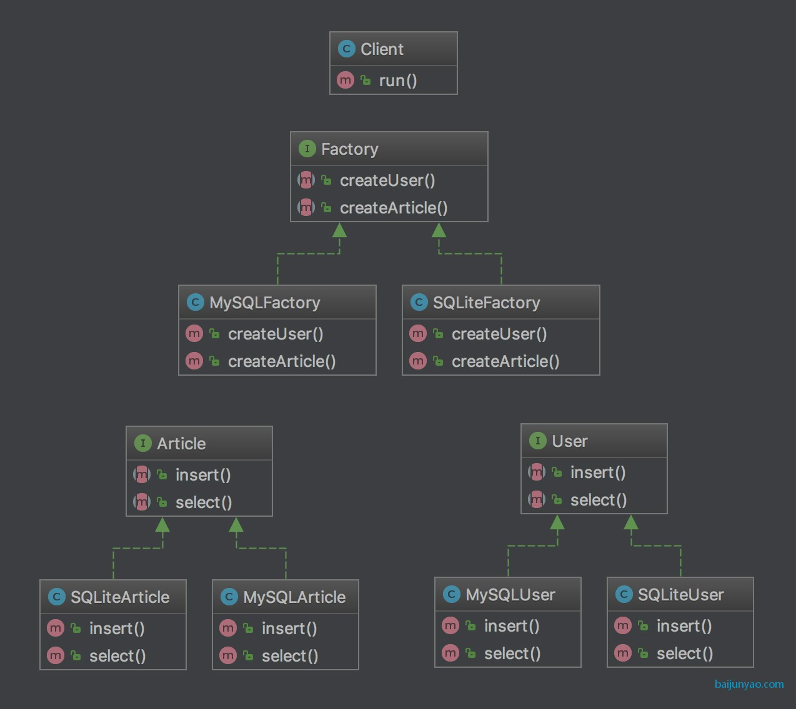
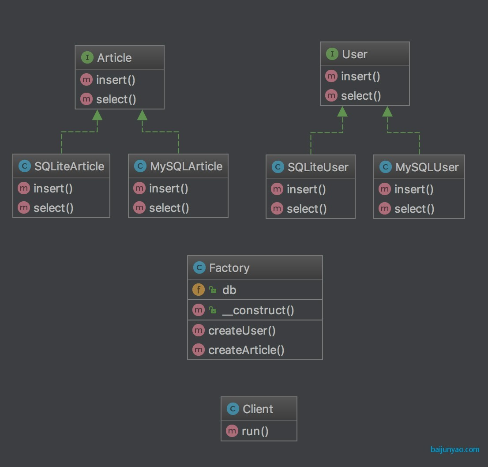

### 抽象工厂模式  Abstract Factory

[简单工厂模式 Simple Facory](./simplefactory.md)

[工厂方法模式 Facory Method](./factorymethod.md)

工厂方法有个问题是每个工厂只能生产一个产品，导致存在大量的工厂；

类比我们现实中的工厂，

生产牙刷造了一个牙刷厂

生产鞋刷又造了一个鞋刷厂

但是其实牙刷和鞋刷都属于刷子

这就是产品族的概念了；

他们属于同一个产品族

我们只要造一个刷子厂同时生产一个产品族下的牙刷和鞋刷即可

> 应用场景

要实例化的对象充满不确定性可能会改变的时候

要创建的对象的数量和类型是未知的

> 结构

多个interface或者abstract产品父类

多个实现interface或者继承abstract的具体产品类

1个interface或者abstract的工厂父类

1个实现interface或者继承abstract的具体工厂类

具体的工厂里面有多个方法分别实例化具体的产品类

[抽象工厂模式 Abstract Facory - 代码](../AbstractFactory)

**continue...** 

[简单工厂和抽象工厂的搭配使用](../AbstractFactoryWithSimpleFactory)

[使用反射来优化抽象工厂类](../AbstractFactoryWithReflection)

