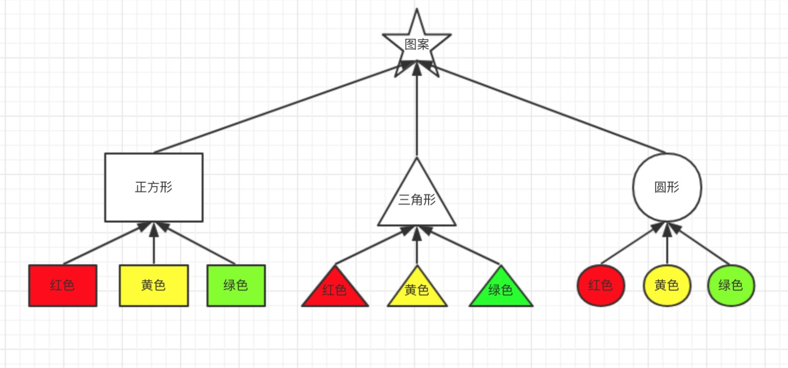
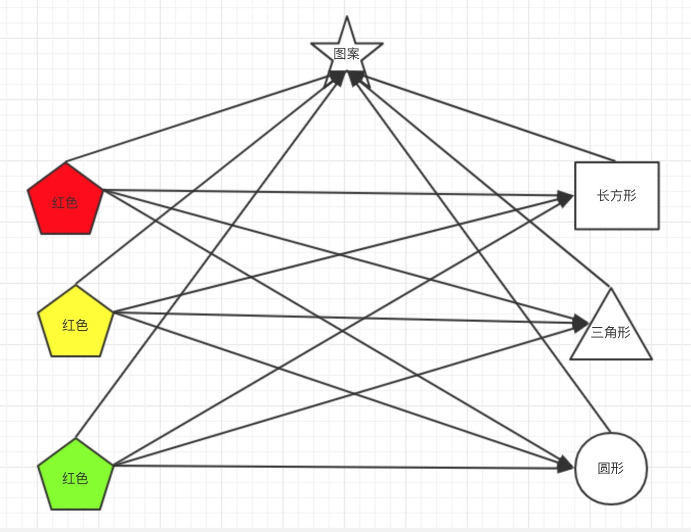
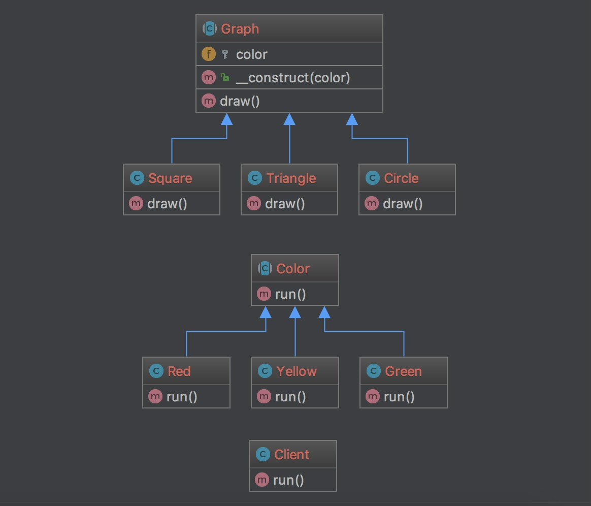

### 桥接模式

交接模式有一个常见的示例：

有正方形、三角形、圆形灯形状

还有红、黄、绿颜色

要实现形状和颜色的组合

最简单的方法就是通过继承

建12个类就行了；

但是如果按照此图的形式来组织代码；

当需要增加形状和颜色的时候，比如增加一个梯形

这个时候就需要增加3个颜色的梯形类

再如果增加一个蓝色

那每个形状都要再增加一个类？？

把形状和颜色类单独创建

然后通过组合的方式来实现各种形状和颜色搭配的图案；

使他们都可以有独立组合

[代码](../Bridge)