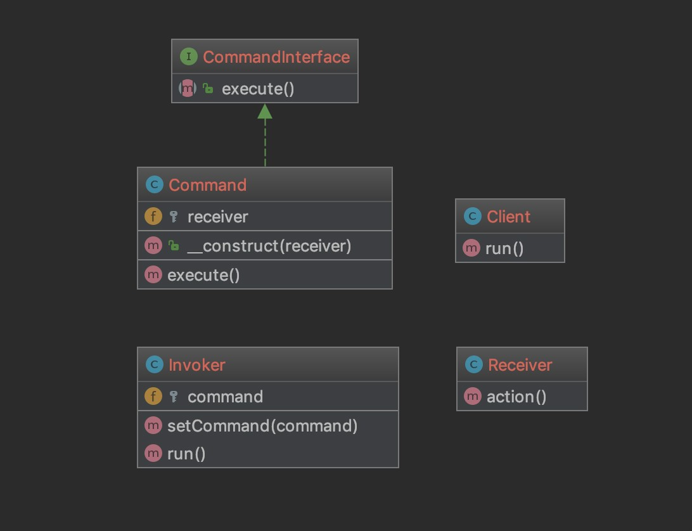

### 命令模式 Command

命令模式就和名字一样

比较适合执行命令的场景

命令发送者只要管调用具体的命令类中的execute()方法

然后在具体命令类中设定命令的接受者

可以消除命令发送者和命令接收者之间的解耦

并且可以方便的扩展新命令

> 结构

CommandInterface 命令抽象类，一般会暴露一个excute方法

Command 具体的命令类，设定接收者

Invoker 命令发送者，用于调用命令

Receiver 命令接受者，负责执行操作

[代码](../Command)