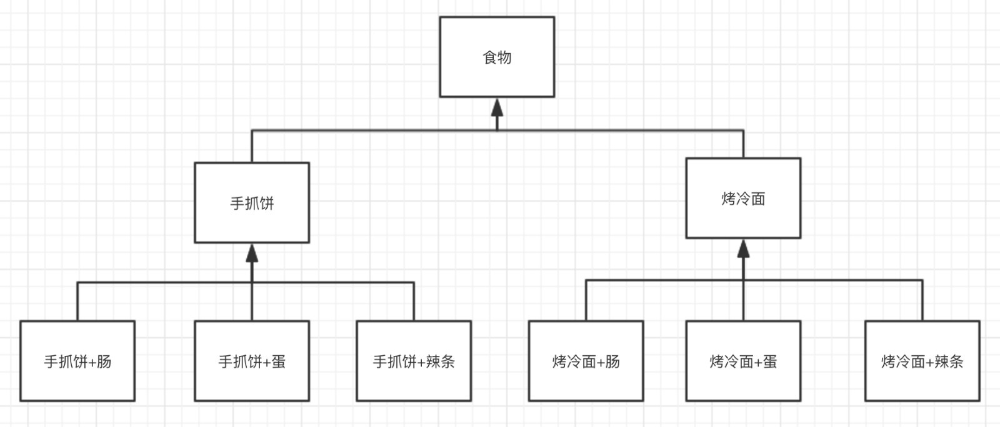
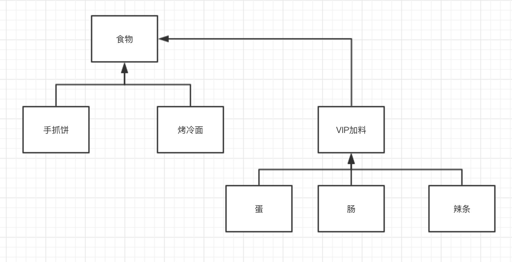
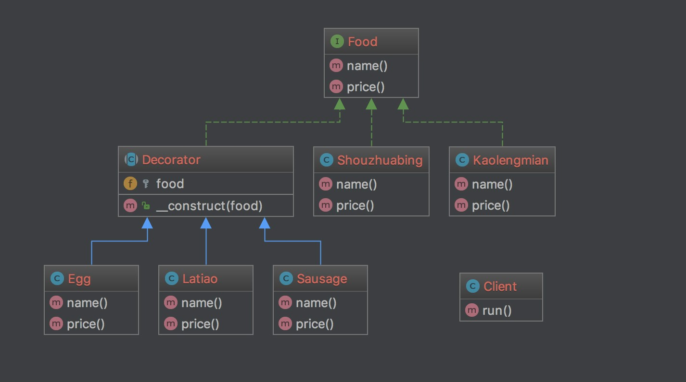

### 装饰模式 Decorator

装饰模式是为已有的类动态的添加更多功能而且不改动原来的类

主要是使用对象的冠梁关系替代继承

就如现实生活中的装饰或者配料一样

我们用吃喝举例

有普通的原味奶茶、手抓饼、冷烤面

还有VIP级的不加加布丁、加肠、加蛋

使用继承可以很简单的实现

但是经过前面的模式理解

我们应该已经有了优于继承的意识了

把配料独立出来

> 结构

    Component：原本的对象和装饰共同的接口
    ConcreteComponent： 原本的对象 示例中指 手抓饼和烤冷面
    Decorator： 实现接口的装饰抽象类
    ConcreteDecorator：具体的装饰 示例中指 肠、蛋、辣条

