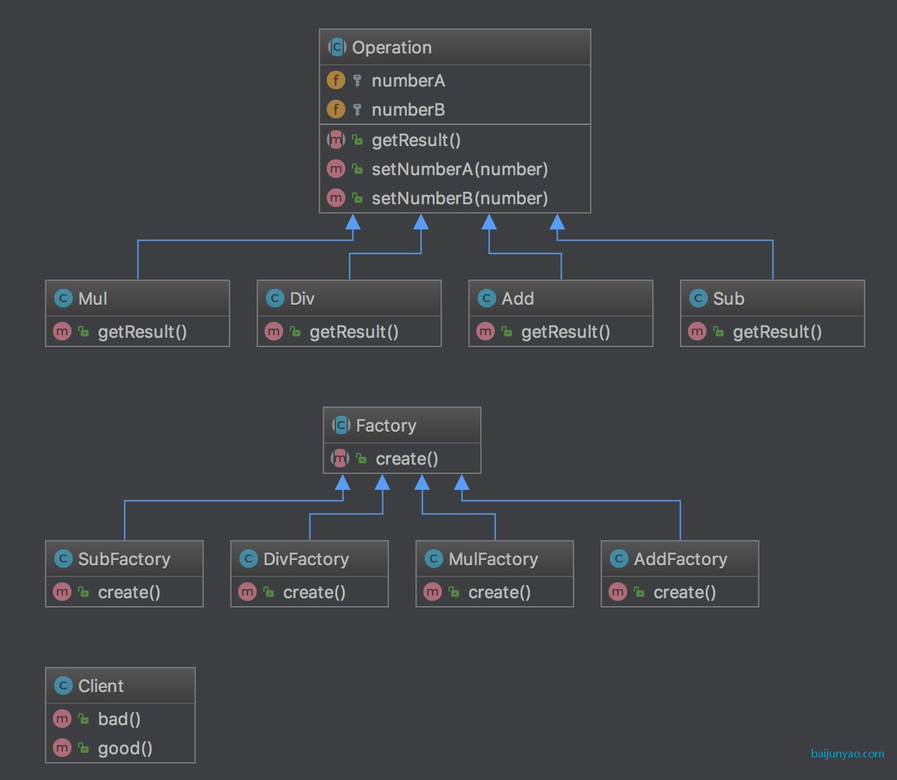

### 工厂方法模式 Factory Method

简单工厂模式违反开放封闭原则；

而工厂方法模式就可以规避此问题；

他需要定义工厂的接口；

让工厂的子类来确定实例化哪一个具体的产品类；

延迟的子类的实例化

> 应用场景

要实例化的对象充满不确定性可能会改变的时候

要创建的对象的数码和类型是未知的；

> 结构

1 个interface或者abstract产品父类；

多个实现interface或者继承abstract的具体产品类；

具体工厂类和具体产品类一一对应

[代码](../FactoryMethod)