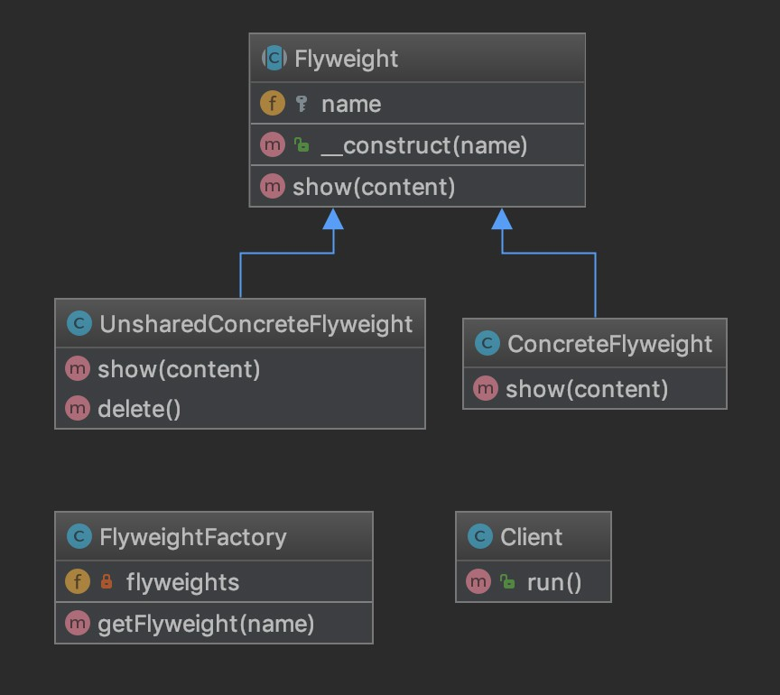

### 享元模式

享元模式的目的是为了减少实例化大量时对内存的占用。

减少是不可能平白无故就减少的

主要是通过复用重复的类来实现的

用现在比较热的词叫共享

就比如说现实生活中：

我们有99件尺寸为L和1件XXL的不同款式的男装要请多少个模特？

毫无疑问2个就够了

> 结果

Flyweight 享元抽象类

ConcreteFlyweight 实现Flyweight接口的可以共享的具体享元类

UnsharedConcreteFlyweight 非共享具体享元类

FlyweightFactory 用于创建和管理具体的享元对象的工厂

[代码](../Flyweight)