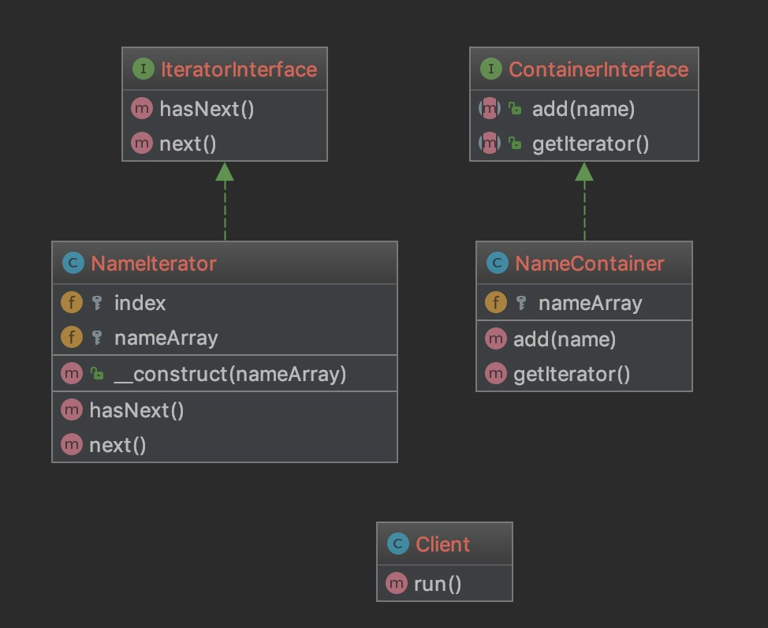

### 迭代器模式 Interator pattern

迭代器模式允许用户通过特定的顺序访问容器中的数据

他将数据和顺序的实现分离

迭代器模式属于设计模式中多个没落贵族

单独实现迭代器的场景很少了

比如PHP官方都提供了[迭代器](http://php.net/manual/zh/class.iterator.php)

此处单独介绍设计模式

> 结构

Container 容器接口 定义获取迭代器的方法 示例中指ContainerInterface

ConcreteContainter 实现Container接口的具体容器类

Iterator 迭代器接口 这里定义了hasNext 和 next 方法

ConcreteIterator 实现Iterator接口的具体迭代器类

[代码](../Iterator)