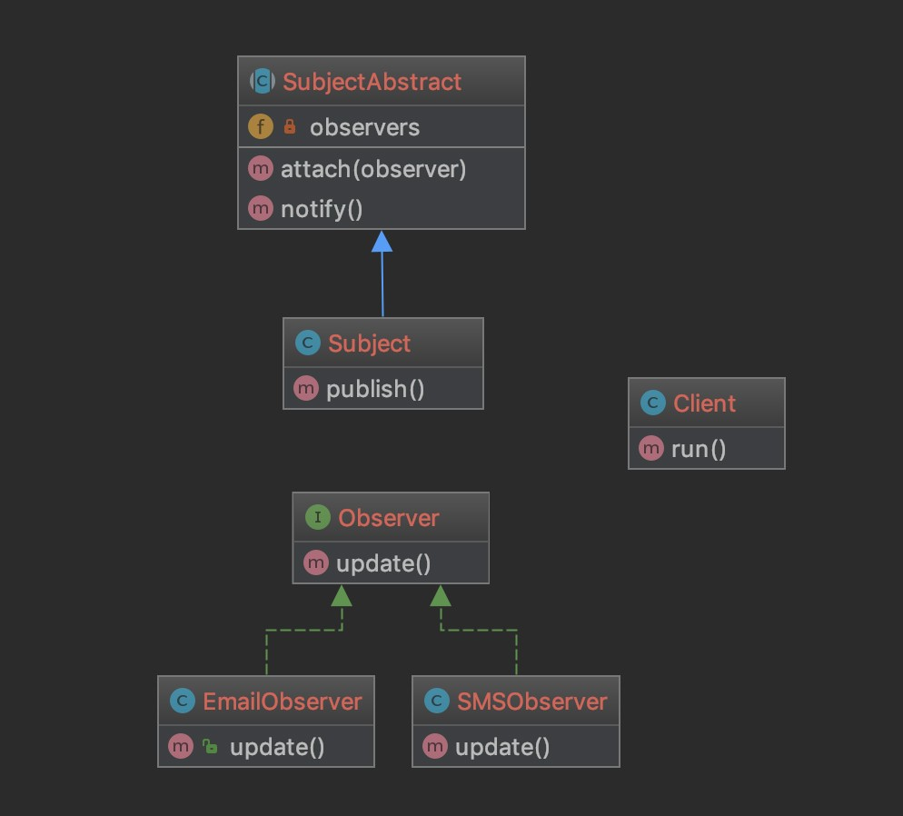

### 观察者模式 Observer Pattern

在业务开发过程中多个功能会相互依赖

如果我们想在一个对象发生变化后通知和它有相关的类

比如说你做了某件事后希望可以使用邮件和短信发送通知

这时候就比较适合使用观察者模式了

不过php官方已经提供了 [SplObserver](http://php.net/manual/zh/class.splobserver.php) 和 [SplSubject](http://php.net/manual/zh/class.splsubject.php)

> 结构 

SubjectAbstract : Subject抽象类

Subject 具体的列

Observer 接口

ConcreteObserver 具体

[代码](../Observer)