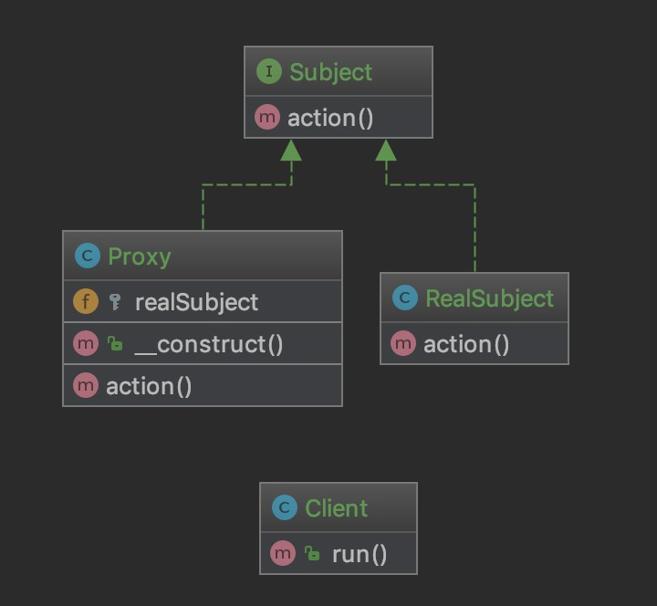

### 代理模式 Proxy

代理模式我们可能不熟悉

但是代理我们大多数程序员都应该用过

比如说为了翻过一堵墙用谷歌去查找资料

或者现实中购买商品我们也不是直接去工厂

而是通过一层层的代理商

> 结构

Subject 主题接口：定义正式主题和代理的公共方法

RealSubject 实现主题接口的真实主题，隐藏在代理之后

Proxy 实现主题接口并在内部引用了真实的主题

[代码](../Proxy)
