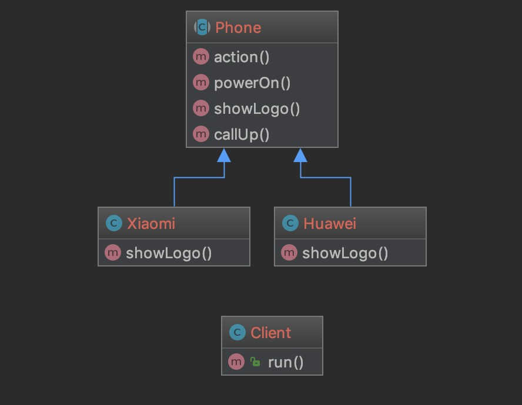

### 模板方法模式 Template Pattern

组合型的设计模式本质是使用组合代替继承

但是继承并非一无是处

只是因为大家容易滥用继承造成耦合

作为面向对象编程的三大特性之一

继承还是很有价值的

比如说本篇要讲的模板方法模式

就是依赖于继承实现

> 结果

抽象类： 定义操作中骨架；比如说执行顺序等，讲具体的执行内容延迟到子类

子类：定义具体的执行内容

[代码](../Template)